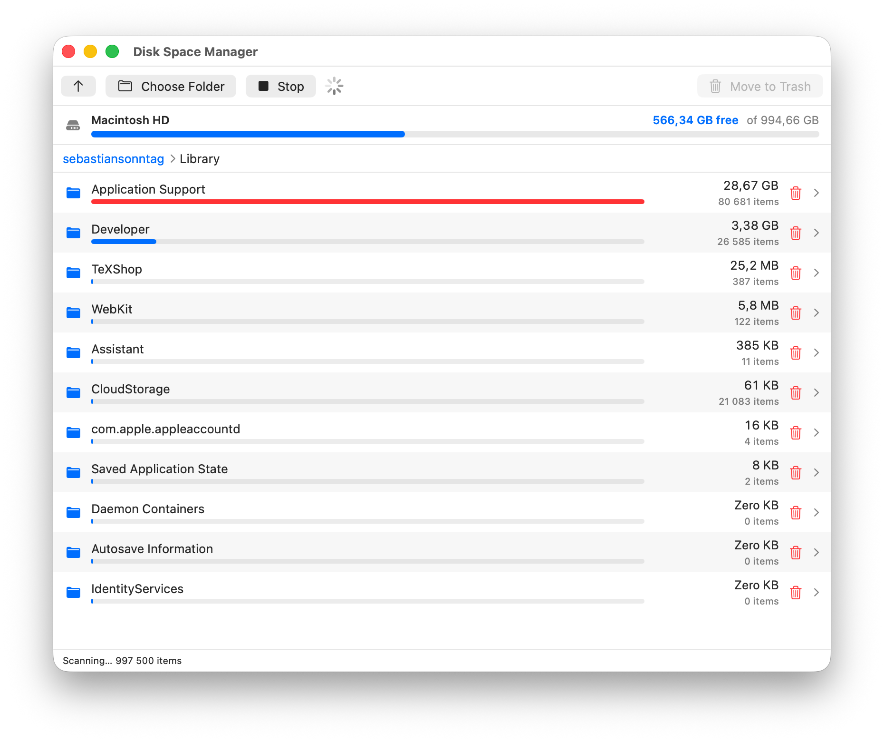

# Disk Space Manager

A free, native macOS disk space analyzer. Scan a folder, browse it sorted by
size, and move space hogs to the Trash. No license, no telemetry, no nag
screens.




## Download

Grab the latest prebuilt app from the
[**Releases**](https://github.com/sebthedoc/mac_diskspace_manager/releases/latest)
page (Apple Silicon, macOS 13+). Unzip it and drag **Disk Space Manager.app**
to `/Applications`.

The build is ad-hoc signed (not notarized), so the first launch is blocked by
Gatekeeper. To open it, **right-click the app → Open → Open**, or run:

```bash
xattr -dr com.apple.quarantine "/Applications/Disk Space Manager.app"
```

On an Intel Mac, build from source instead (see below).

## Features

- **Live scanning** — the list appears the instant scanning starts; folders pop
  in and their size bars grow and reorder in real time as the scan proceeds.
  You don't wait for it to finish to start looking around.
- **Scan any folder** — defaults to your home directory on launch.
- **Browse by size** — every folder shows its children largest-first, with a
  colored bar (red = biggest hitters) and a recursive item count.
- **Drill down** — double-click a folder to go in; breadcrumb + ↑ button to go back.
- **Delete safely** — select items and *Move to Trash* (⌘⌫), or right-click a
  single item. Nothing is permanently deleted; everything goes to the Trash.
- **Instant updates** — trashing an item updates the sizes up the tree without
  a rescan. Hit **Rescan** (⌘R) anytime to re-read from disk.
- **Reveal in Finder** from the right-click menu.
- Includes hidden files and dot-directories (where caches usually hide).

## Build & run

Requires the Swift toolchain from Xcode or the Command Line Tools
(`xcode-select --install`).

```bash
./build.sh
open "build/Disk Space Manager.app"
```

Install it like any app:

```bash
cp -r "build/Disk Space Manager.app" /Applications/
```

## First-launch notes

- On first scan macOS may prompt for access to **Desktop / Documents /
  Downloads** — that's the standard privacy (TCC) prompt; click *Allow* to let
  the scan see those folders. The app is ad-hoc code-signed so the grant sticks.
- The app is unsigned by a developer certificate (it's free). If Gatekeeper
  complains, right-click the app → **Open**, or run
  `xattr -dr com.apple.quarantine "build/Disk Space Manager.app"`.

## How sizes are measured

Files report their **on-disk allocated size** (falling back to logical size),
summed bottom-up into each folder. Symlinks are never followed, so nothing is
double-counted and there are no scan loops.

## Known limitations

- The full file tree is held in memory, so scanning a very large home directory
  (millions of files) uses substantial RAM. Scan a subfolder if that's a concern.
- Sizes are a snapshot from the last scan; use **Rescan** after big changes
  made outside the app.

## Project layout

```
Sources/DiskSpaceManager.swift   # entire app (model, scanner, SwiftUI views)
build.sh                         # compiles + bundles into a .app
```

Free to use, modify, and share.
